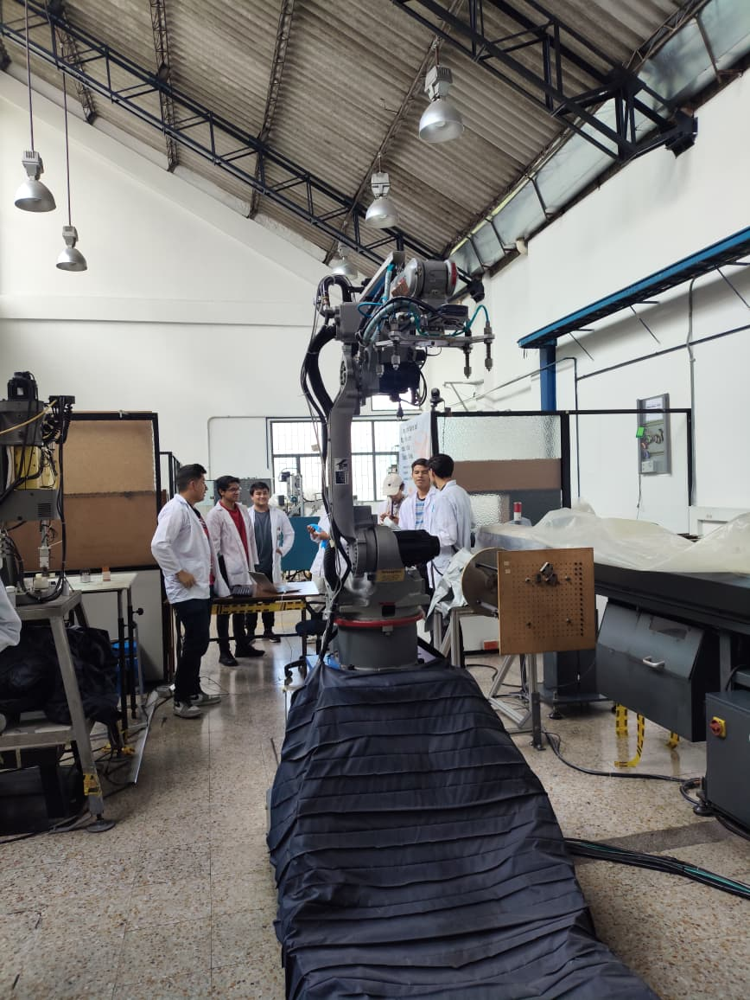
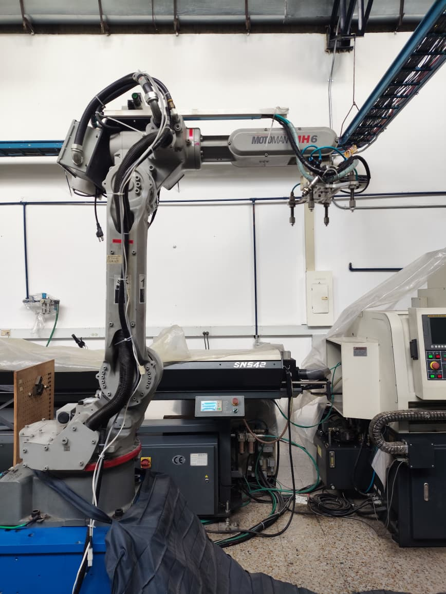
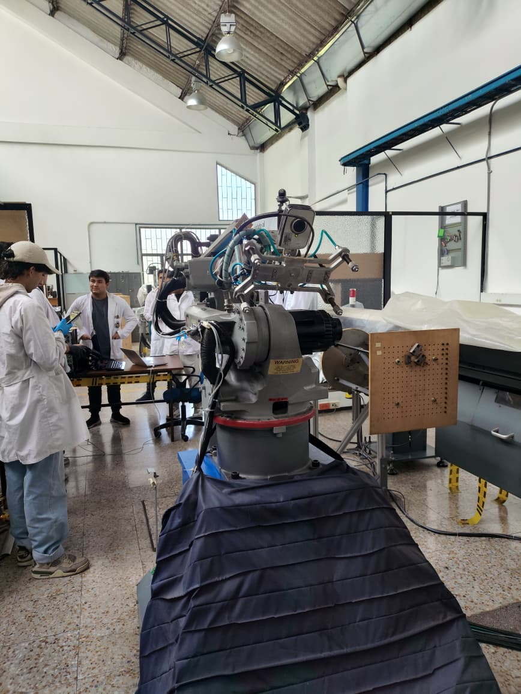
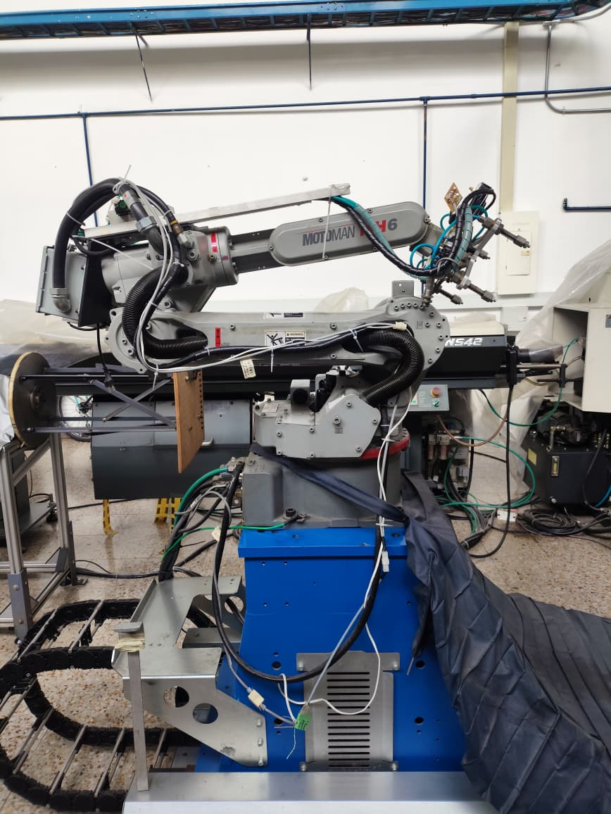
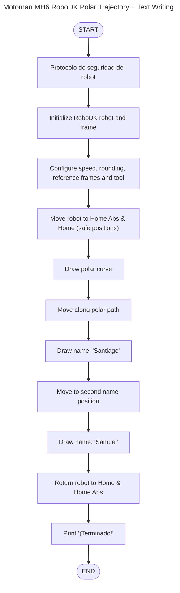
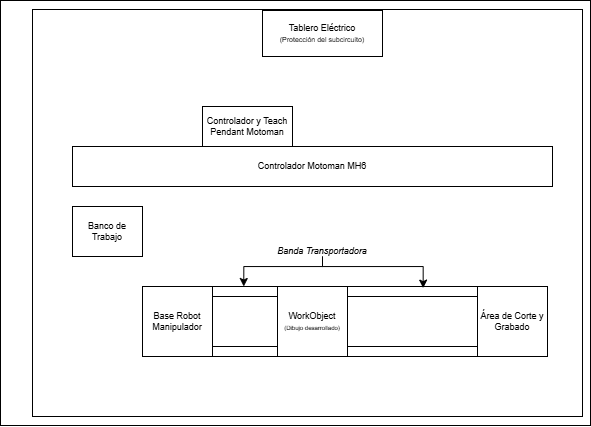

<div align="center">
  
</div>

---

# 🤖 robotic-MOTOMAN — RoboDK · Yaskawa Motoman MH6

> **Resumen:** Práctica de laboratorio del curso *Robótica Industrial* que integra programación y simulación en RoboDK y ejecución real con **Motoman MH6**. El sistema automatiza el trazo de una trayectoria polar sobre un espacio de trabajo inclinado.

---

## 🧾 Autores
- **Samuel David Sanchez Cardenas** — Desarrollo, simulación y documentación.  
  [](https://github.com/samsanchezcar)
- **Santiago Ávila** — Colaboración en diseño y pruebas.  
  [](https://github.com/search?q=Santiago+Avila)

---

## 📋 Tabla de Contenidos

1. [Introducción](#introducción)
2. [Objetivos](#objetivos)
3. [Comparación Técnica de Manipuladores](#cuadro-comparativo-de-características-técnicas)
4. [Configuraciones Home](#características-posiciones-home-y-second-home)
5. [Procedimientos de Operación Manual](#procedimiento-detallado-para-movimientos-manuales)
6. [Control de Velocidad](#explicacion-niveles-de-velocidad-para-movimientos-manuales)
7. [Software RoboDK](#software-robodk)
8. [Comparación RoboDK vs RobotStudio](#comparación-robodk-vs-robotstudio)
9. [Desarrollo de la Práctica](#desarrollo-de-la-práctica-trayectoria-polar)
10. [Resultados](#resultados)
11. [Conclusiones](#conclusiones)
12. [Referencias](#referencias)

---

## 📖 Introducción

Los manipuladores industriales son herramientas clave en la automatización industrial. Cada modelo tiene sus propias características técnicas y configuraciones iniciales que los hacen ideales para diferentes aplicaciones. En este taller, se busca realizar una comparación técnica entre el manipulador Motoman MH6 y el ABB IRB140, comprender las configuraciones iniciales del Motoman MH6, explorar los diferentes modos de operación manual, y realizar simulaciones y ejecuciones reales de trayectorias usando RoboDK.

---

## 🎯 Objetivos

- Comprender las diferencias entre las características técnicas del manipulador Motoman MH6 y el IRB140
- Identificar y describir las configuraciones iniciales del manipulador Motoman MH6, incluyendo el home1 y home2
- Realizar movimientos manuales del manipulador Motoman en distintos modos de operación (articulaciones, cartesianos, traslaciones y rotaciones)
- Cambiar y controlar los niveles de velocidad para el movimiento manual del manipulador Motoman MH6
- Comprender las principales aplicaciones del software RoboDK y su comunicación con el manipulador
- Comparar y analizar las diferencias entre RobotStudio y RoboDK
- Diseñar y ejecutar una trayectoria polar en RoboDK y realizar su implementación física en el manipulador Motoman

---

## Cuadro comparativo de características técnicas

| Característica                     | **Yaskawa Motoman MH6** | **ABB IRB 140** |
|------------------------------------|--------------------------|-----------------|
| **Carga máxima (payload)**         | 6 kg                     | 6 kg            |
| **Alcance máximo**                 | 1422 mm                  | 810 mm          |
| **Grados de libertad (ejes)**      | 6                        | 6               |
| **Repetibilidad**                  | ±0.08 mm                 | ±0.03 mm        |
| **Velocidad máxima de ejes**       | S-U: 220°/s<br>L: 200°/s<br>R-B: 410°/s<br>T: 610°/s | Ejes 1–2: 200°/s<br>Eje 3: 260°/s<br>Ejes 4-5: 360°/s<br>Eje 6: 450°/s|
| **Peso del robot**                 | 130 kg (aprox.)          | 98 kg (aprox.)  |
| **Controlador típico**             | DX100                    | IRC5            |
| **Aplicaciones típicas**           | Manufactura aditiva, ensamblado, dispensado, soldadura ligera, manipulación de materiales | Soldadura por arco, ensamblaje, manipulación, embalaje, pulido |
| **Ventajas principales**           | Gran alcance con baja carga útil; estructura ligera | Alta precisión, tamaño compacto, fácil integración |
| **Recomendado para**               | Trabajos de alcance extendido | Espacios reducidos o tareas de alta repetibilidad |

---

## Características posiciones Home y Second Home

### Home 1 - Posición de Calibración

<div align="center">
<table>
<tr>
<td></td>
<td></td>
</tr>
</table>
</div>

| **Eje** | **Nomenclatura** | **Posición (°)** |
|---------|------------------|------------------|
| **1** | S (Swing) | 0.000 |
| **2** | L (Lower) | 88.663 |
| **3** | U (Upper) | -81.079 |
| **4** | R (Rotate) | -0.002 |
| **5** | B (Bend) | 51.762 |
| **6** | T (Twist) | -3.271 |

### Home 2 - Posición de Trabajo

<div align="center">
<table>
<tr>
<td></td>
<td></td>
</tr>
</table>
</div>

| **Eje** | **Nomenclatura** | **Posición (°)** |
|---------|------------------|------------------|
| **1** | S (Swing) | 0.000 |
| **2** | L (Lower) | -1.567 |
| **3** | U (Upper) | 1.714 |
| **4** | R (Rotate) | 0.000 |
| **5** | B (Bend) | -0.147 |
| **6** | T (Twist) | -3.271 |

La posición **Home** es la postura de calibración del manipulador, con referencias de eje como chaveteros o flechas de alineación, donde se registran los datos absolutos del codificador de cada eje. Esto permite que el controlador lea todos los 0’ para cada eje bajo la posición actual en esta postura.

Esta posicion normalmente no debe ser modificada ni eliminada, solo en situaciones de reemplazar piezas del manipulador referentes al motor/codificador, placa de circuitos, desvio de las marcas por impactos, problemas de perdida de energía, etc.

La posición **Home2** por su parte se utiliza como punto de control para la calibración de *Home*, a menudo cuando ocurre la alarma 4107 (Out of Range Abso Data). La ubicación predeterminada de SECOND HOME (Punto especificado) para el robot es donde los datos de pulso para cada eje se muestran como todos ceros y las flechas de alineación o las teclas para cada eje están alineadas.

***¿Cual posición es mejor?***

En general, si bien ambas posiciones existen con propositos distintos, Home1 (la “Home Position” de fábrica) es la ideal, pues representa la calibración original de todos los ejes y sirve como referencia precisa para la repetibilidad, mantenimiento y diagnósticos. Home2 es útil como respaldo o posición de chequeo, pero no reemplaza la Home1 salvo en situaciones de fallo o recalibración de la posicion Home1.

Por tanto, se puede considerar la mejor(o al menos la que es utilizada de forma normal en el robot) como Home1, porque garantiza que todos los ejes están en su referencia original y permite que el controlador y los programas trabajen con los valores que fueron definidos en fábrica. Además, emplear consistentemente Home1 favorece la trazabilidad, repetibilidad y mantenimiento predictivo del sistema.

---

## Procedimiento detallado para movimientos manuales

### 1. Preparación del sistema
Antes de realizar cualquier movimiento con el robot es necesario:
1. Asegurar el área de trabajo (correcta posición inicial y condición del robot, evitar obstáculos en el área)
2. Encender los breakers del Motoman y el breaker totalizador, para después encender el controlador **DX100** por medio de la perilla, y verificar su funcionamiento correcto
3. Colocar la **llave de modo** del Teach pendant en posición **TEACH** (modo de enseñanza)
4. Verificar que el botón de parada de emergencia esté desactivado y que el indicador **SERVO ON** esté activado; de lo contrario, presionar el botón **SERVO ON READY** del Teach pendant

### 2. Selección del modo de operación

#### 🔹 Modo por Articulaciones (*Joint Jog*)
Permite mover **cada eje (J1 a J6)** de forma individual.

**Pasos:**
1. En el péndulo de enseñanza, presiona la tecla **COORD** hasta que aparezca **JOINT** en pantalla
2. Mantener presionado el botón de Hombre Muerto para energizar los motores
3. Usar las teclas de movimiento de eje (**+ / -**) para cada eje numerado *S, L, U, R, B, T*
4. Observar en la pantalla el ángulo de cada articulación mientras se realiza

#### 🔹 Modo Cartesiano (*Linear / TCP Jog*)
Permite mover el **punto de herramienta (TCP)** en los ejes cartesianos **X, Y, Z**, ideal para movimientos precisos o alineación con piezas.

**Pasos:**
1. Presiona la tecla **COORD** hasta que aparezca el sistema deseado:
   - **BASE**: movimiento respecto a la base del robot
   - **WORLD**: movimiento global
   - **TOOL**: movimiento respecto a la herramienta (TCP)
2. Usar los botones **+ / -** del eje que desea mover (**X, Y, Z** en los botones izquierdos del Teach Pendant) o rotar (**X, Y, Z** en los botones del lado derecho del Teach Pendant)
3. Observar en la pantalla el cambio de coordenadas mientras el movimiento se realiza

### 3. Ejecución de movimientos

1. Mantener presionado el **botón de habilitación (Enable / Deadman switch)** mientras realiza los movimientos
2. Ejecutar los desplazamientos de forma **suave y progresiva** para evitar choques
3. Monitorear la pantalla: se mostrará el modo actual y las coordenadas en tiempo real
4. De necesitar un movimiento preciso, modificar la velocidad del movimiento con los botones del Teach Pendant

---

## Explicación niveles de velocidad para movimientos manuales

### 1. Niveles de velocidad disponibles

| Nivel de velocidad | Descripción | Botón en teach pendant |
|--------------------|------------|-------------------------|
| **SLOW (lento)**  | Movimiento seguro y preciso, ideal para ajustes finos | `SLOW` |
| **FAST (medio)**  | Velocidad intermedia para desplazamientos normales | `FAST` |
| **HIGH SPEED (rápido)** | Movimiento a la máxima velocidad manual permitida (solo cuando es seguro) | `HIGH SPEED` |

> 🔸 *La velocidad en modo manual nunca alcanza la velocidad máxima de ejecución automática; está limitada por seguridad.*

### 2. Procedimiento para cambiar el nivel de velocidad

1. Estar en **modo TEACH** y con el **Servo Power** activado
2. Observar la pantalla del teach pendant: en la parte superior aparece una **barra o indicador de velocidad**
3. Usar los botones dedicados:
   - Presiona **`SLOW`** → velocidad baja
   - Presiona **`FAST`** → velocidad media
   - Presiona **`HIGH SPEED`** → velocidad alta
4. El cambio es inmediato, el nuevo nivel se muestra actualizado en la barra de velocidad
5. Ejecutar el movimiento deseado

---

## 💻 Software RoboDK

### Descripción de funcionalidades principales

RoboDK es un software de simulación y programación offline para robots industriales que permite:

- **Simulación 3D**: Modelado y visualización del entorno de trabajo
- **Programación offline**: Generación de programas sin detener la producción
- **Multi-marca**: Compatible con más de 500 modelos de robots
- **Post-procesamiento**: Conversión automática a código nativo del robot
- **Detección de colisiones**: Validación de trayectorias antes de ejecución
- **API Python**: Automatización y personalización de procesos

### Comunicación con el manipulador

RoboDK se comunica con el Motoman MH6 mediante:

1. **Protocolo TCP/IP**: Conexión Ethernet al controlador DX100
2. **Puerto 10040**: Puerto estándar para comunicación Motoman
3. **Transferencia FTP**: Envío de programas INFORM generados
4. **Post-procesador**: Convierte las instrucciones de RoboDK a lenguaje INFORM

### ¿Qué hace RoboDK para mover el manipulador?

1. **Genera trayectorias** en el entorno virtual
2. **Valida movimientos** mediante simulación
3. **Post-procesa** el código a lenguaje INFORM
4. **Transfiere** el programa al controlador DX100
5. **Ejecuta** las instrucciones en el robot físico

---

## 📊 Comparación RoboDK vs RobotStudio

| Aspecto | **RoboDK** | **RobotStudio** |
|---------|------------|-----------------|
| **Compatibilidad** | Multi-marca (+500 robots) | Solo robots ABB |
| **Costo** | Licencia comercial/educacional | Incluido con robots ABB |
| **Lenguaje** | Python API | RAPID |
| **Curva de aprendizaje** | Moderada | Empinada |
| **Post-procesadores** | Personalizables | Nativos ABB |
| **Simulación** | Buena precisión | Virtual Controller exacto |
| **Aplicaciones** | Entornos heterogéneos | Producción con ABB |

**¿Qué significa para usted cada una de estas herramientas?**

- **RoboDK**: Herramienta versátil y flexible para entornos con múltiples marcas de robots, ideal para prototipado rápido y aplicaciones educativas
- **RobotStudio**: Solución especializada para robots ABB con máxima fidelidad de simulación, óptima para producción con equipos ABB

---

## 🔧 Desarrollo de la Práctica: Trayectoria Polar

### Análisis del código RoboDK

El código implementado utiliza la API de RoboDK para generar una trayectoria polar compleja que incluye:

#### 1. Inicialización y configuración
```python
from robodk.robolink import *    # API para comunicación con RoboDK
from robodk.robomath import *    # Funciones matemáticas para transformaciones
import math
import numpy as np
from matplotlib.textpath import TextPath
from matplotlib.font_manager import FontProperties

# Configuración inicial
RDK = Robolink()
robot = RDK.ItemUserPick("Selecciona un robot", ITEM_TYPE_ROBOT)
frame = RDK.Item("Frame_from_Target1", ITEM_TYPE_FRAME)
robot.setPoseFrame(frame)
robot.setSpeed(500)  # Velocidad 500 mm/s
robot.setRounding(5)  # Radio de redondeo 5 mm
```

#### 2. Definición de posiciones de trabajo
```python
z_surface = 0        # Altura de la superficie
z_safe = -50        # Altura de seguridad
home = transl(0, 0, z_surface + z_safe)
home_abs = transl(0, 0, z_surface - 300)
```

#### 3. Función de trayectoria polar
```python
def polar(x_offset, y_offset, A, n):
    num_points = 180
    full_turn = 2 * math.pi
    for i in range(num_points + 1):
        t = i / num_points
        theta = full_turn * t
        r = A * (4 + math.cos(n * theta) + math.sin(n * theta) ** 2)
        x = r * math.cos(theta) + x_offset
        y = r * math.sin(theta) + y_offset
        robot.MoveL(transl(x, y, z_surface))
```

La ecuación polar implementada es: **r = A * (4 + cos(n*θ) + sin²(n*θ))**

Esta genera una curva cardioide modificada con:
- **A = 30**: Amplitud de la curva
- **n = 5**: Factor de forma que determina el número de lóbulos
- **180 puntos**: Para suavidad en la trayectoria

#### 4. Función de escritura de texto
```python
def draw_text_with_path(text, x_offset, y_offset, z,
                        font_size=75, font_name='Arial',
                        rotation_deg=90, mirror_x=True):
```

Esta función:
- Utiliza **matplotlib.textpath** para generar trayectorias de texto
- Aplica transformaciones de **espejo en X** y **rotación de -90°**
- Implementa levantamiento automático entre caracteres

### 🔁 Diagrama de flujo


### Plano de planta del laboratorio

<div align="center">

</div>

**Distribución de elementos:**
- Tablero eléctrico de protección de subcircuito (parte posterior)
- Controlador DX100 y Teach Pendant (zona de control)
- Robot Motoman MH6 (centro del área de trabajo)
- Banco de trabajo rotativo (lateral)
- WorkObject para dibujo y práctica (frontal)
- Banda transportadora del robot (zona inferior)
- Espacio para corte y grabado (lateral derecho)

### Código desarrollado en RoboDK

El código completo se encuentra en el archivo de RoboDK dentro de la carpeta con el mismo nombre.

---

## 📊 Resultados

### Video de simulación en RoboDK

<div align="center">

[](https://youtu.be/ysggLDzJOy0)

**[Ver en YouTube: Simulación de Trayectoria Polar - Motoman MH6](https://youtu.be/ysggLDzJOy0)**


</div>

**Características de la simulación:**
- Trayectoria cardioide sin colisiones
- Escritura de nombres "Santiago" y "Samuel"
- Validación de límites articulares

### Video de implementación física

<div align="center">

[](https://youtu.be/IRRw6QZOKoE)

**[Ver en YouTube: Implementación Física - Motoman MH6](https://youtu.be/IRRw6QZOKoE)**


</div>

**Resultados obtenidos:**
- Ejecución exitosa sin errores
- Trayectoria completada según diseño
- Calidad de trazo uniforme

---

## 🎓 Conclusiones

1. **Comparación técnica**: El Motoman MH6 destaca por su mayor alcance (75% superior al IRB 140), siendo ideal para aplicaciones que requieren gran volumen de trabajo. El IRB 140 sobresale en precisión con una repetibilidad de ±0.03 mm.

2. **Configuraciones Home**: La existencia de múltiples posiciones home permite optimizar el robot para diferentes situaciones operacionales, siendo Home1 fundamental para calibración y Home2 óptima para operación productiva.

3. **Modos de operación**: La flexibilidad entre modos articular y cartesiano facilita tanto la programación como la operación manual del manipulador.

4. **Control de velocidad**: Los tres niveles de velocidad (SLOW, FAST, HIGH SPEED) permiten adaptar el movimiento según los requerimientos de seguridad y precisión de cada tarea.

5. **Software RoboDK**: Demostró ser una herramienta versátil para programación offline, permitiendo la validación de trayectorias complejas antes de su implementación física.

6. **Trayectoria polar**: La implementación exitosa de la trayectoria cardioide con elementos de texto valida la capacidad del sistema para aplicaciones de manufactura aditiva y trazado de precisión.

7. **Comunicación efectiva**: La integración entre RoboDK y el controlador DX100 mediante protocolo TCP/IP demuestra la madurez de los estándares industriales.

---

## 📚 Referencias

[1] Laboratorio No. 02 - Robótica Industrial - Análisis y Operación del Manipulador Motoman MH6. Universidad Nacional de Colombia, 2025.

[2] Product Manual ABB IRB 140. ABB Robotics Documentation.

[3] Product Manual ABB IRC5 Controller. ABB Robotics Documentation.

[4] Manual de Programación Básica DX100. Yaskawa Electric Corporation.

[5] Spong, M. W., Hutchinson, S., & Vidyasagar, M. (2020). *Robot Modeling and Control* (2nd ed.). John Wiley & Sons.

---

<div align="center">
  
</div>
